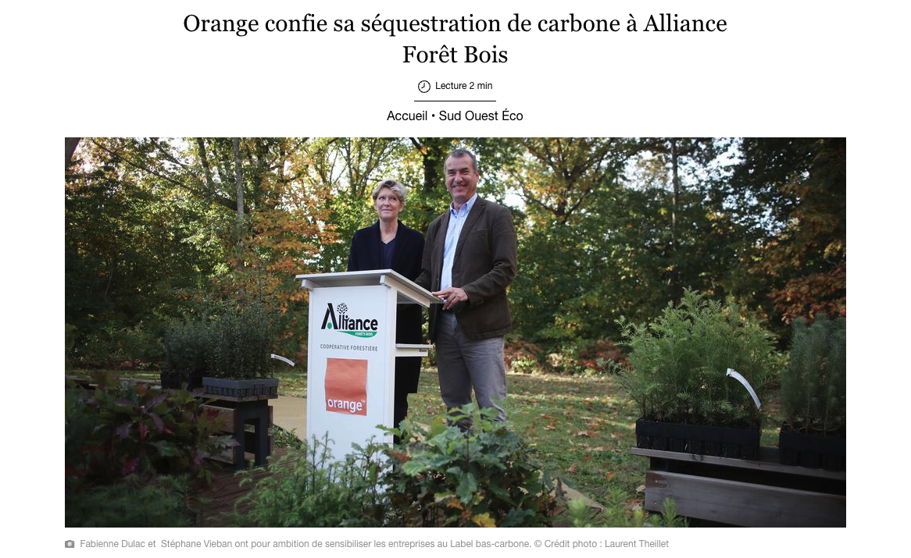
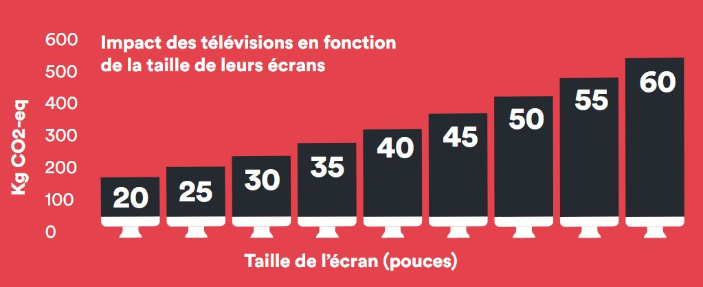

## ADSL ou Fibre ?

La différence entre ADSL et fibre est surtout au niveau du débit, la fibre est bien plus rapide que l'ADSL.

Un rapport de l'ARCEP révèle que ADSL consomme en moyenne 1,8 Watt par ligne, soit **trois fois plus que la fibre optique.** Attention toutefois à l'effet rebond, c'est à dire de se mettre à consommer plus du fait d'avoir la fibre.

Enfin un critère important pour les petits budgets : l'ADSL est moins cher que la fibre.

# Le choix du Fournisseur d'Accès à Internet (FAI)

### Le débit

Dans les zones rurales le débit annoncé par le FAI peut ne pas être à la hauteur, surtout pour l'ADSL. Si vous êtes à la campagne vous pouvez mener votre enquête auprès de vos voisins. 

Dans les zones urbaines vous rencontrerez probablement pas de souci de ce type.

### Le prix et le service client

Évidement tenez compte du prix des offres. Les offres les moins chères ont souvent un moins bon service client, laissant l'Internaute devant se débrouiller seul pour effectuer les premiers diagnostics sans possibilité de parler à un interlocuteur.

### MoralScore.org

Le site MoralScore.org effectue un classement des fournisseurs de forfait mobile, on y retrouve les différents FAI. Le classement se fait sur les valeurs de l'entreprise, en créant un compte et en renseignant ses propres valeurs il est possible de trouver celles qui vous correspond le plus. Cela va des prix faibles au respect de l'environnement en passant par la fiscalité de l'entreprise.

[Cliquez-ici pour voir ce classement](https://moralscore.org/sectors/operateurs/).

Les annonces de décarbonation annoncées sont les plus ambitieux chez Free et Bouygues Telecom.

Toutefois en creusant, aucun n'est parfait 

* SFR : réalise des "optimisations fiscales", mauvaise condition de travail. [Voir le détail de SFR sur MoralScore](https://moralscore.org/companies/sfr/)
* RED by SFR : réalise des "optimisations fiscales", mauvaise condition de travail. [Voir le détail de RED by SFR sur MoralScore](https://moralscore.org/companies/red-by-sfr/)
* Bouygues : réalise des "optimisations fiscales". [Voir le détail sur MoralScore](https://moralscore.org/companies/bouygues-telecom/)
  Vous pouvez préférez l'offre [Source Mobile](https://www.sourcemobile.fr/) qui est l'offre responsable et solidaire de Bouygues.
* Orange : [selon MoralScore](https://moralscore.org/companies/orange/) les conditions de travail y sont mauvaise. 
  Aussi Orange s'est fait épinglé par [l'association Canopée](https://www.canopee-asso.org/) pour faire du [Greenwashing en finançant Alliance Forêts Bois](https://www.canopee-asso.org/greenwashing-canopee-interpelle-alliance-forets-bois/) qui effectue des [coupes rases de forêts](https://www.youtube.com/watch?v=OxI0g31Sq8k&t=1005s) pour y planter des pins maritimes destinés à leur industrie.

  

### Choisir un FAI alternatif

Destiné à un public plus averti et engagé, les FAI alternatifs s'opposent à l'hégémonie de quelques entreprises sur Internet.

* [French Data NetWork](https://www.fdn.fr/) : un FAI associatif national
* [FAI Maison](https://www.faimaison.net/) : un FAI associatif nantais

## Remise en perspective

N'oublions pas toutefois que ce qui a le plus d'impact dans le secteur numérique c'est le matériel utilisateur. S'il existe une action bien plus imporante que celle de bien choisir son FAI, c'est celle de ne pas acheter une TV trop grande.

Infographie par [BonPote.com](bonpote.com) : 

