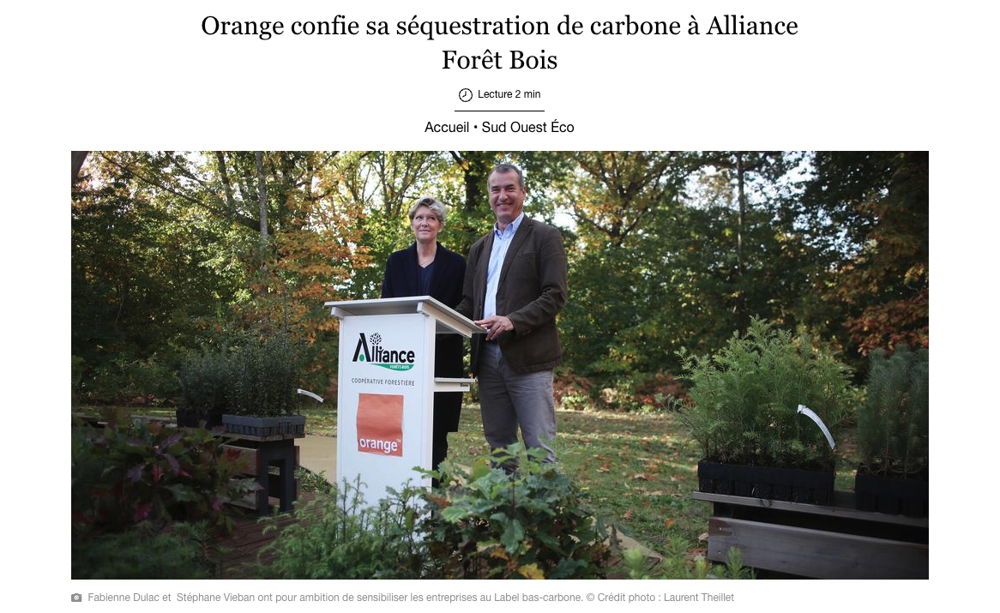

## Intro

Lorsque l'on doit choisir un forfait mobile le prix est souvent l'un des critères principaux.

Le second critère est souvent d'avoir le plus de DATA possible, c'est à dire avoir le plus gros forfait des données mobiles en 3G/4G/5G.

Or les données mobiles consomment près de 20 fois plus d'énergie que le WIFI pour diffuser le même volume de données.
Cela signifie donc aussi plus d'infrastructure réseau et donc tous les impacts négatifs (sociaux et environnementaux) liés à la fabrication de ce matériel réseau.

Nous vous proposons ici d'abord de modifier votre manière d'utiliser vos données mobiles, puis de choisir un forfait en conséquence.
C'est à dire un forfait avec moins de données, donc potentiellement moins cher.

Nous vous proposons aussi des forfaits engagés

## Modifier ses usages

Partant du principe que les données mobiles polluent beaucoup plus que le Wifi, vos usages vont avoir pour objectifs d'en réduire au maximum l'utilisation.

Si vous consommez plus de 10Go de données mobiles par mois c'est probablement que vous abusez de vidéo en ligne avec la 3G/4G/5G.

Regarder des vidéos surtout mais aussi dans une moindre mesure écouter de la musique, consomment beaucoup de données mobiles. 
Il faut donc privilégier d'attendre d'avoir du Wifi pour le faire.

Une alternative est de télécharger à l'avance, quand vous avez du Wifi, votre contenu afin de pouvoir le consulter sans solliciter le réseau quand vous être en déplacement.
Par exemple pour la musique, vous pouvez télécharger sur votre application (exemple sur Deezer) vos chansons préférées lorsque vous avez du Wifi.
Ensuite à chaque écoute d'une musique déjà téléchargées aucune donnée mobiles ne sera utilisées.

### N'oubliez pas : ce que a le plus d'impact c'est le matériel

80% des impacts de votre smartphone se produisent lors de sa fabrication, les 20% restants c'est les usages que vous en ferez.

Ne prenez donc pas de forfait qui vous incite à changer/acheter un nouveau smartphone, cela aurait bien plus d'impact que vos efforts pour éviter de regarder des vidéos en 4G.
Fuyez les forfaits avec des smartphones à tarifs réduits. Privilégiez un achat de smartphone reconditionné, et uniquement quand vous en aurez vraiment besoin.

## Les forfaits

### Telecoop : le forfait le plus éthique

C'est le forfait le plus engagé de cette liste, mais probablement aussi le plus cher.
Il s'adresse aux personnes de convictions près à mettre la main au portefeuille pour réduire au maximum leurs impacts sociaux et environnementaux.
Chaque Go de Data est refacturé, ce forfait implique donc d'être sobre dans ces usages. L'opérateur pousse à la sobriété et aide ses utilisateurs à réduire les impacts environnementaux de leurs usages numériques.

* [TeleCoop](https://telecoop.fr/)

TeleCoop est membre du collectif [FairTech](https://fairtec.io/fr/) qui propose au grand public des offres pour un numérique plus responsable.
FairTech est composé de TeleCoop, Fairphone, /e/Os et Commown.

### Source Mobile : un forfait solidaire par Bouygues Telecom

Source mobile vous permet de reverser vos données mobiles non-utilisées sous forme de dons à des associations, sans contrainte de le faire.
Source mobile vous propose un forfait avec beaucoup de données mobiles, mais vous incite à éviter de les utilisées (ça pollue), 
et si vous y arrivez vous pouvez alors convertir vos data non-utilisées en dons à des associations de votre choix.

* [Source mobile](https://www.sourcemobile.fr/)

### Prix tel : forfait neutre en CO2

PrixTel s'engage à compenser les émissions de CO2 des forfaits de leurs clients en plantant des arbres.
Plusieurs forfaits sont proposés, nous vous conseillons de prendre le forfait ayant le moins de data afin de minimer votre impact sur l'environnement.

* [PrixTel](https://www.prixtel.com/)

### La poste mobile

La Poste Mobile est une entreprise française qui mène de nombreuses actions aussi bien sociales, fiscales qu'environnementales :

* [C'est l'opérateur mobile le mieux classé sur le site Moral Score (classement incomplet)](https://moralscore.org/companies/la-poste-mobile/)

### Se baser sur Moral Score

Le site MoralSocre.org propose un classement d'entreprise de différents secteurs selon les valeurs morales moyennes inscrits du site.
Si vous vous créez un compte vous pourrez renseigner vos propres valeurs et trouver l'entreprise la plus en phase avec vous.

* [Le classement des opérateurs mobiles](https://moralscore.org/sectors/operateurs/)

### Les forfaits pas chers avec peu de données mobiles

La dernière solution que nous vous proposons est de choisir un forfait qui possède entre 1Go et 6Go de données mobiles par mois, c'est suffisant pour un usage raisonné de son smartphone.
Ce sont des forfaits souvent bons marchés.
Faites attention à ce que le prix n'augmente pas après quelques mois.

Vous trouverez la liste des forfaits ici, il vous suffit de trier par prix.

Soyez tout de même conscients que ces prix bats sont obtenus parce que les entreprises qui les pratiques rémunèrent mal leurs employés, 
ne paient pas correctement leurs impôts et ne font que très peu d'effort pour participer à la vie de la collectivité (sociale et environnementale).

* [Liste de forfaits](https://www.touslesforfaits.fr/)

### A éviter

* SFR : réalise des "optimisations fiscales", mauvaise condition de travail. [Voir le détail de SFR sur MoralScore](https://moralscore.org/companies/sfr/)
* RED by SFR : réalise des "optimisations fiscales", mauvaise condition de travail. [Voir le détail de RED by SFR sur MoralScore](https://moralscore.org/companies/red-by-sfr/)
* Bouygues : réalise des "optimisations fiscales". [Voir le détail sur MoralScore](https://moralscore.org/companies/bouygues-telecom/)
  Vous pouvez préférez l'offre [Source Mobile](https://www.sourcemobile.fr/) qui est l'offre responsable et solidaire de Bouygues.
* Orange : [selon MoralScore](https://moralscore.org/companies/orange/) les conditions de travail y sont mauvaise. 
* Aussi Orange s'est fait épinglé par [l'association Canopée](https://www.canopee-asso.org/) pour faire du [Greenwashing en finançant Alliance Forêts Bois](https://www.canopee-asso.org/greenwashing-canopee-interpelle-alliance-forets-bois/) qui effectue des [coupes rases de forêts](https://www.youtube.com/watch?v=OxI0g31Sq8k&t=1005s) pour y planter des pins maritimes destinés à leur industrie.

